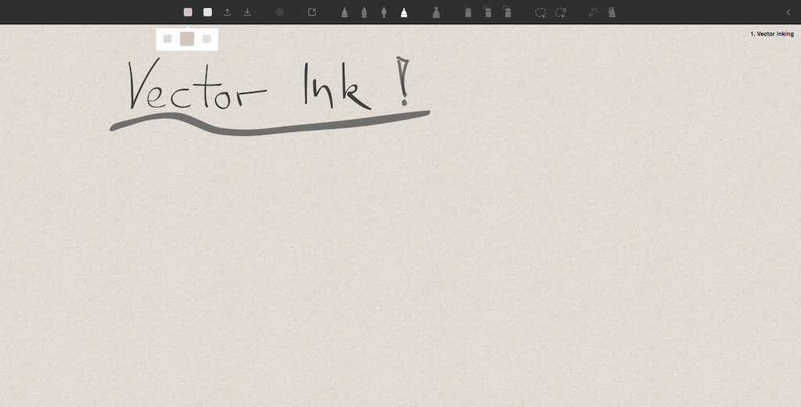
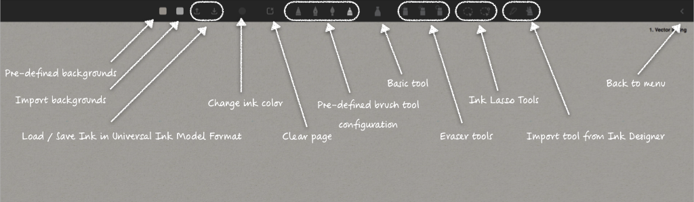
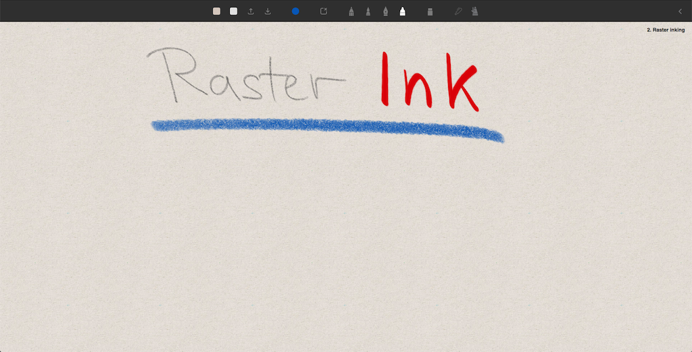
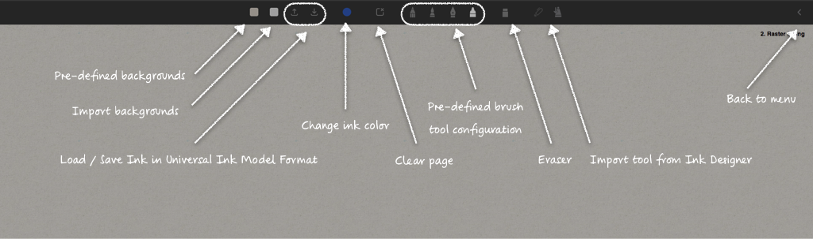
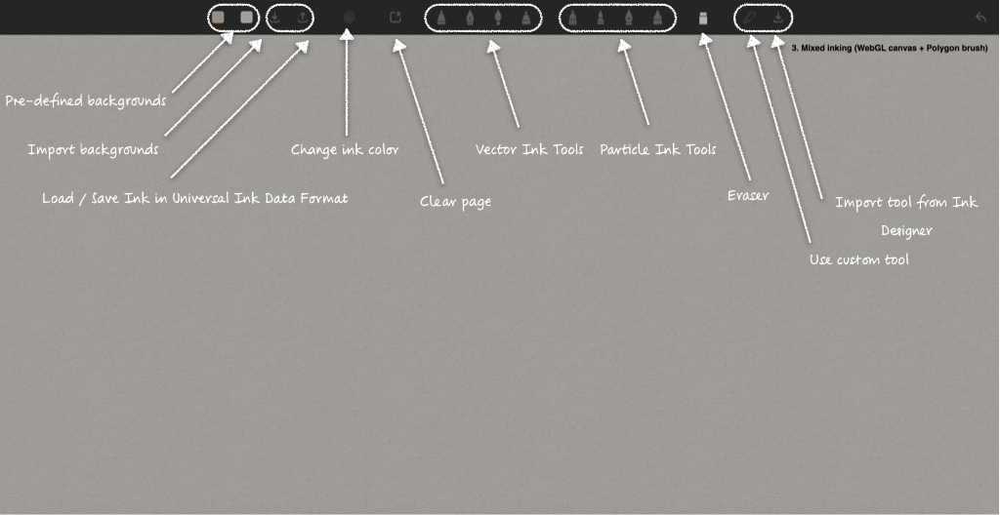

# Getting Started

## Web Development Environment

To run the sample code first ensure you have installed the following:

* node.js e.g. download from [node.js](https://nodejs.org/en/download/)
* python e.g. [python 3.8.3](https://www.python.org/downloads/release/python-383/)
  (check that Python has been added to the Windows path variable)


## Download the SDK

Download the SDK from https://developer.wacom.com/developer-dashboard

* Login using your Wacom ID
* Select **Downloads for ink**
* Download **WILL SDK for ink for Web (version 3)**
* Accept the End User License Agreement to use the SDK

The downloaded Zip file contains the SDK ink engine accessed by the sample code.


## SDK License

The SDK is free of charge and does not need a license.

---

## Using the WILL SDK Sample Code

* copy these folder from the downloaded sdk to the samples folder
    * *wacom/digital-ink*
* start a command prompt in the samples folder
* use the command ```npm install``` to create the node_modules folder

The web based app needs a web server.
Python's `SimpleHTTPServer` provides an easy way to get started.
To start the web server, start a command prompt in the project root folder and run:

```
# Python 2:
python -m SimpleHTTPServer 8080

# Python 3:
python -m http.server 8080
```

Now you can access the web-demo via:

```http://localhost:8080/index.html```


> **Note:**  We recommend starting with Chrome or Firefox browsers as some versions of Edge can be incompatible.

---

# Sample code description

The sample application demonstrates ink rendering through the use of WILL SDK for ink (v3.0) using a JavaScript implementation.
Moreover, it shows how the handling of ink data using the Universal Ink Model is realized.

WILL rendering provides two different kinds of rendering techniques: vector and raster rendering.
Vector rendering is a technique that fills the stroke boundary of a path with solid color *(see Figure 1.1)* .


*Figure 1.1: Screenshot of vector web rendering.*

Figure 1.2 provides a short explanation of the functionality provided by the sample.


*Figure 1.2: Screenshot of vector web rendering.*

Raster rendering is a technique that renders strokes using overlapping particles *(see Figure 2.1)*.
This technique allows you to build more expressive tools (such as crayon, pencil, or watercolor brushes).


*Figure 2.1: Screenshot of raster web rendering.*

Figure 2.2 provides a short explanation of the functionality provided by the sample.


*Figure 2.2: Overview of the functionality of raster rendering.*

Figure 3 shows a canvas combining the raster and the vector rendering.


*Figure 3: Canvas offering mixed rendering techniques.*


## Brush Tools

### Importing a brush tool

The **Ink Designer** provides an easy way to configure the parameters of a brush tool and the related pipeline configuration.

The [Ink Designer](http://developer-docs.wacom.com/sdk-for-ink/docs/ink-designer) page provides a link to the tool with supporting documentation.

Via its export function the tool can be downloaded and imported within the sample application.

### Programmatically create a brush tool

The following snippet shows how to define a simple pencil brush:

```javascript
	pencil: new ParticleBrush(0.15, 0.15,
									ParticleBrush.RotationMode.RANDOM,
									"/images/textures/essential_shape.png",
									"/images/textures/essential_fill_11.png",
									true),
```
The parameters are explained in **Ink Designer**.


## Ink Rendering

The ink geometry pipeline transforms pointer input data to ink geometry.
In the sample application the geometry pipeline is created and configured in the `InkCanvas` class.
`InkCanvasVector` extends the pipeline for vector 2D rendering.
`InkCanvasRaster` is specialized for raster (particle) WebGL rendering.

In order to use the pipeline, you need to create a data layout that specifies the content of the ink paths.
Here is a basic ```layout``` where path points have X, Y coordinates and variable size:

```javascript
    var layout = [
        PathPoint.Property.X,
        PathPoint.Property.Y,
        PathPoint.Property.SIZE
    ];
```

The sample application adds more properties (including rotation, scale and offset).
*Config.js* provides several different sample configurations suitable for different input devices.

### The PathPoint Calculator

The `calculator` is a method that you pass to the `InkBuilder`.
It defines how data from pointer events are transformed to path points.
The sample application provides several examples of path point calculator methods, dependent from pointer input - pen, mouse or touch and provides proper data to ink builder.
They can be found in the *Config.js* script.

### Building Ink

In order to build ink in real time you need to handle pointer input events pointer-down, pointer-move, pointer-up and provide input to the `InkBuilder`.
The *On Begin* phase is selected to correspond to pointerType.
`drawPath` updates the canvas on every frame.
The `pathPart` provided from `InkBuilder` contains two collections - added and predicted (or preliminary) data.
The added data becomes a permanent part of the stroke, while predicted data is temporary and should be displayed only in the current frame.

`BrushPalette` defines some brushes.
`InkBuilder` needs to know what brush will be used for rendering.
Vector Inking needs a `PolygonBrush` which is used to define the brush shape.
Raster Inking needs the `ParticleBrush` `spacing` property.
The `spacing` parameter specifies the distance between different particles along the path trajectory.

### Rendering Ink

Once the ink geometry is produced it can be displayed using `StrokeRenderer`.
It should be configured in the constructor.
There are two classes - `StrokeRenderer2D` and `StrokeRendererGL` that provide a similar interface.
It takes the parameter `canvas` which is used as the drawing surface.
The sample application shows efficient rendering of vector ink and particle ink in real time.

Real-time rendering is implemented in the sample application with a technique that uses several layers as raster cache.
The current stroke (added geometry) is stored in a "current stroke" layer.
New chunks are rasterized using `BlendMode.Max`.
The updated rectangle of the "current stroke" layer is copied to a "preliminary stroke" layer.
Then the polygon of the predicted stroke is rendered in the "preliminary stroke" layer, again with `BlendMode.Max`.
The scene "below" the updated area is reconstructed and then the updated piece is copied from the "preliminary stroke" layer to the "scene" layer.
Before presenting, the "scene" layer is copied to the canvas.

In the sample application, collection and rendering of ink is managed by the `StrokeRenderer`.
It creates and maintains the Graphics object and the various Layer objects.
It is configured with a vector brush or raster brush object to handle brush-specific parts of geometry production and rendering;
and receives input which is passed on to an InkBuilder via the Brush.

#### Rendering Vector Ink

The output from the geometry pipeline for vector ink is a pair of polygons which are rendered using the draw method of the `StrokeRenderer`.

#### Rendering Particle Ink

The output from the geometry pipeline for raster ink is a pair of interpolated splines - which are actually sequences of interpolated points.
Using the draw method of the StrokeRenderer these sequences can be rendered as particles using a raster brush with shape and fill textures.

## Ink Serialization

### Universal Ink Model

To serialize and deserialize the InkDocument - the data model within memory - the InkCodec is used.
`encodeInkDocument` encodes the `InkDocument` and produces a byte array encoding in the *.uim* file format described here: [Universal Ink Model](http://developer-docs.wacom.com/sdk-for-ink/docs/model)

To decode the content of the *.uim* file `decodeInkDocument` is used to create an `InkDocument`.


---


