### **Overview**
* * *

### 
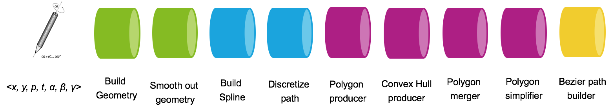

WILL 3.0 is a pipeline, consisted of a chain of processing blocks (processors, producers, etc.). The input of the pipeline is pointer (touch, stylus, mouse) data, which passes through a set of processing stages. The output of each stage is taken as input by its successor. The main goal of the pipeline is to create digital ink. However, its generic implementation allows much broader set of capabilities.

### **Input**
* * *

* **Position** - defined by **x** and **y** coordinates - the position of the input point.
* **Phase** - the phase of the input (**Begin, Update/Move, End**).
* **Timestamp** - the timestamp of the input, used to calculate velocity.
* **Pressure** - [OPTIONAL] - a.k.a pressure, the value reported by a pressure sensitive stylus/display.
* **Radius** - [OPTIONAL] - the size of the touch input.
* **Altitude Angle** -  [OPTIONAL] - the angle between the input device and plane of writing. Measured in radians - between 0 and π/2.
* **Azimuth Angle** - [OPTIONAL] - the angular distance along the plane of writing to the location of the object. By convention, azimuth is measured from top towards bottom (north towards east) along the plane. Measured in radians - between 0 and 2π.

### 
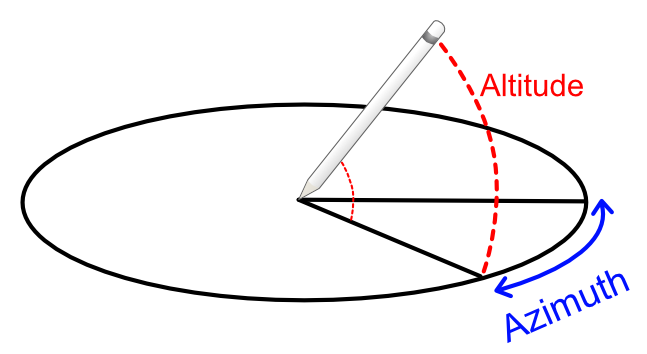

### **Internal Representation and Models**
* * *

* **Pointer Data** - (a.k.a Input Data/Touch Data) - the input in the format described above
* **PathPoint** - the internal representation of point
* **Path** - Flat set of PathPoints, each of which is computed by calculator which can be either predefined or passed from outside.

### 
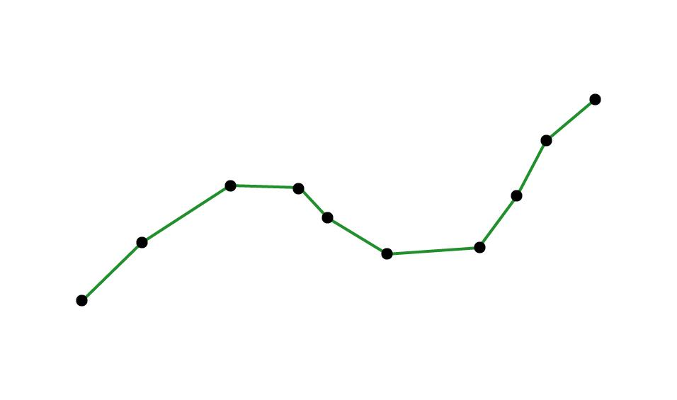

* **Layout** - the descriptor of the items in each path point.
* **Spline** - centripetal Catmull–Rom spline, defined by its control points

### 

* **Point Set\*** - a set of points that define a filled area with specific form (not just a point)

### 
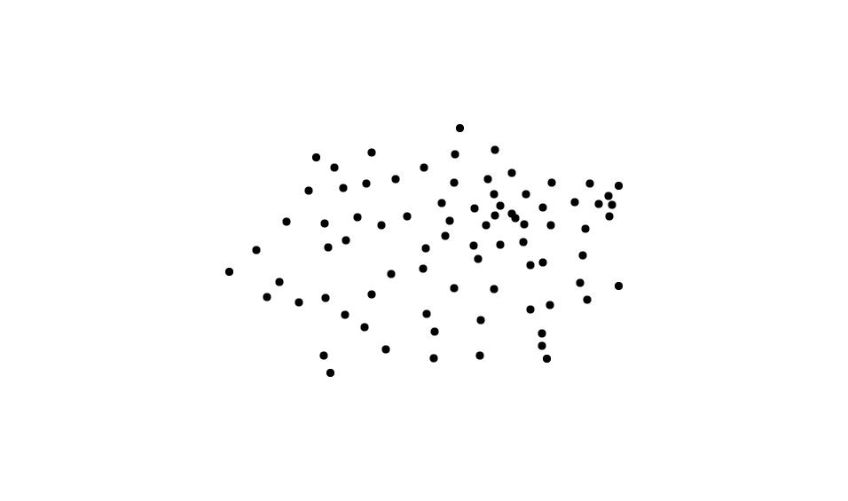

* **Polygon** - polygons are created from Point Sets using convex-hull. The polygon is Collection<DIPoint2>.

### 
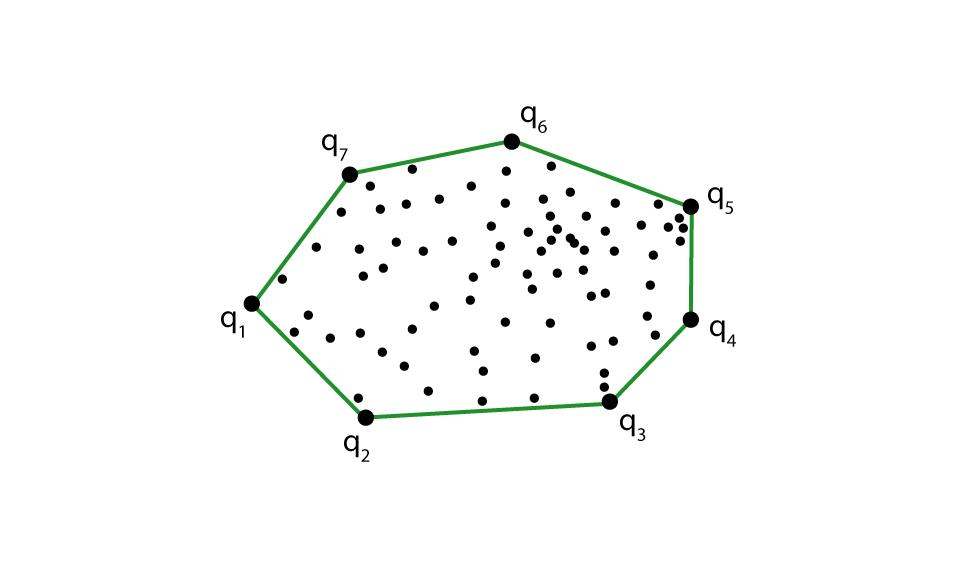

**Data Classes:**

*   **DIPoint2** - 2D point with x and y coordinates
*   **DIPoint3** - 3D point with x, y and z coordinates
*   **DIPoint4** - 3D point with x,y,z coordinates and width
*   **DIPointList2D** - Collection<DIPoint2>
*   **DIPolyline** - Collection<DIPoint2>

_\*In our case we use simple brush that is defined by its hull and not by a point set._

### **Pipeline**
* * *

**BaseDataProcessor**

The base class is inherited by all the pipeline stages.

It defines two abstract methods:
*   add(phase: Phase, addition: Input, prediction: Input): Pair<Output, Output\>
*   reset()

**PathProducer**

Converts the input into internal path representation based on the supplied layout.

Constructor Parameters (wrapped into a Config class):

* Layout
* Calculator - lambda function that converts the input into Path Point

Add parameters:

* Addition - InputData - the input which we want to process
* Prediction - InputData - a prediction for a future input

Output:

* Addition - Path as Collection<Float>
* Prediction - Path as Collection<Float>

**Smoother**

Makes the path smoother via Double Exponential Smoothing. A negative result of the smoothing is that the result lags with one point.

Constructor Parameters:
*   The size of the layout (used as stride for processing the input)

Add parameters:

* Addition - Collection<Float> -the path generated by the TouchToPathProducer
* Prediction - Collection<Float>- the prediction path generated by the TouchToPathProducer

Output:

* Addition - Path as Collection<Float>
* Prediction - Path as Collection<Float>

**SplineProducer**

Adds two control points, one in the beginning and one at the end of the path in order to produce Catmull-Rom spline.

Constructor Parameters:

* The size of the layout (used as stride for processing the input)

Add parameters:

* Addition - Collection<Float> - the path
* Prediction - Collection<Float>- the prediction path

Output:

* Addition - Spline as Collection<Float>
* Prediction - Spline as Collection<Float>

**SplineInterpolator**

Discretizes the spline by adding points along its trajectory, spaced out according to the spacing parameters.

Constructor Parameters:

* Layout
* Spacing - the spacing between two consecutive as a multiplier (fraction if below 1) of the size
* Split Count - the amount of splits

Add parameters:

* Addition - Collection<Float> - the spline
* Prediction - Collection<Float>- the prediction spline

Output:

* Addition - Spline as Collection<Float>
* Prediction - Spline as Collection<Float>

**BrushApplier**

Converts the spline into a collection of point sets, by replacing the points with **brush polygons**.

Constructor Parameters:

* Layout
* Brush Polygon - the polygon that defines the brush

Add parameters:

* Addition - Collection<Float> - the spline
* Prediction - Collection<Float>- the prediction spline

Output:

* Addition - Collection<DIPointList2D>
* Prediction - Collection<DIPointList2D>

**ConvexHullChainProducer**

Creates a **[convex hull](https://en.wikipedia.org/wiki/Convex_hull)** around each two consecutive point sets, using the [monotone chain](https://en.wikibooks.org/wiki/Algorithm_Implementation/Geometry/Convex_hull/Monotone_chain) algorithm.

Add parameters:

* Addition - Collection<DIPointList2D> - the collection of point sets
* Prediction - Collection<DIPointList2D> - the prediction collection of point sets

Output:

* Addition - Collection<DIPolygon>
* Prediction - Collection<DIPolygon>

**PolygonMerger**

Merges polygons using Union. Uses the [Clipper library](http://www.angusj.com/delphi/clipper.php) and its respective ports in the different platforms.

Add parameters:

* Addition - Collection<DIPolygon> - the collection polygons generated by the ConvexHullChainProducer
* Prediction - Collection<DIPolygon> - the prediction collection polygons generated by the ConvexHullChainProducer

Output:

* Addition - Collection<DIPolygon>
* Prediction - Collection<DIPolygon>

**PolygonSimplifier**

Takes the curve composed of line segments (polygons) and finds a similar curve with fewer points, using the [Ramer–Douglas–Peucker algorithm](https://en.wikipedia.org/wiki/Ramer%E2%80%93Douglas%E2%80%93Peucker_algorithm).

Constructor Parameters:

* Epsilon - the dissimilarity threshold

Add parameters:

* Addition - Collection<DIPolygon> - the collection simplified polygons
* Prediction - Collection<DIPolygon> - the prediction collection simplified polygons

Output:

* Addition - Collection<DIPolygon>
* Prediction - Collection<DIPolygon>

### **Visual Representation of the Pipeline**
* * *

### 
Input

### 
**↓**

### 
PathProducer

### 
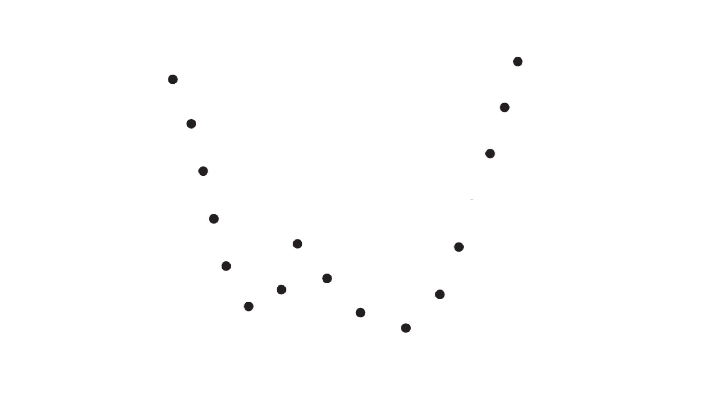

### 
↔ Smoother

### 
**↓**

### 
SplineProducer

### 
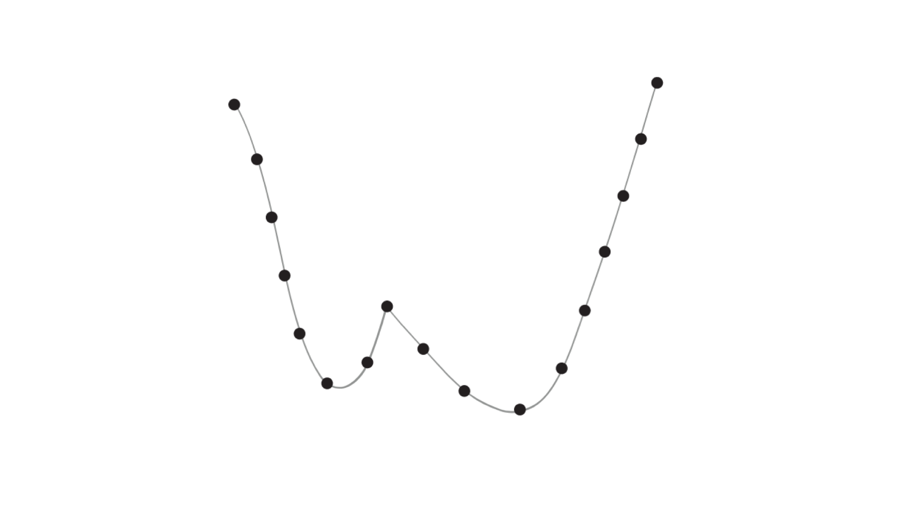

### 
**↓**

### 
SplineInterpolator

### 
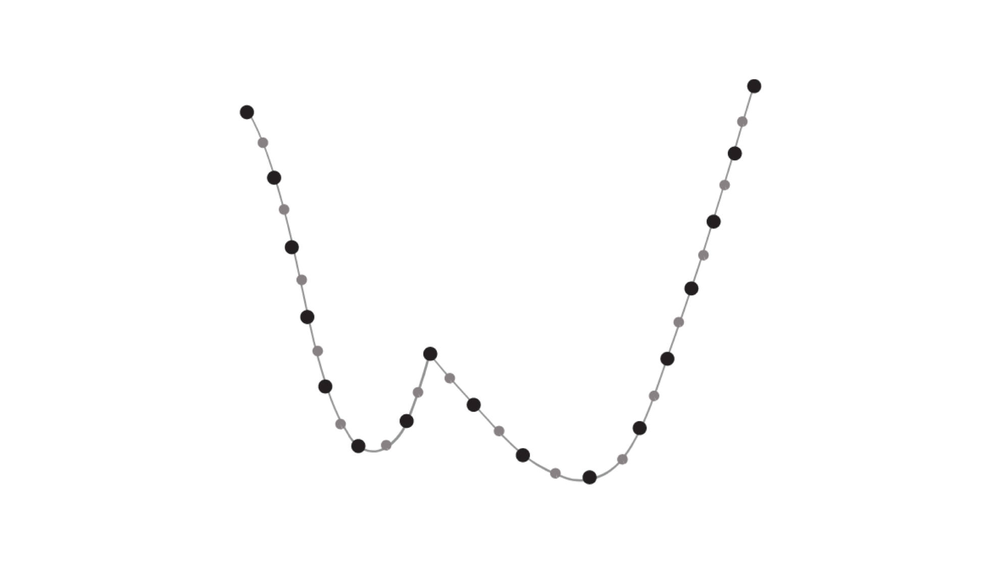

### 
**↓**

### 
BrushApplier

### 
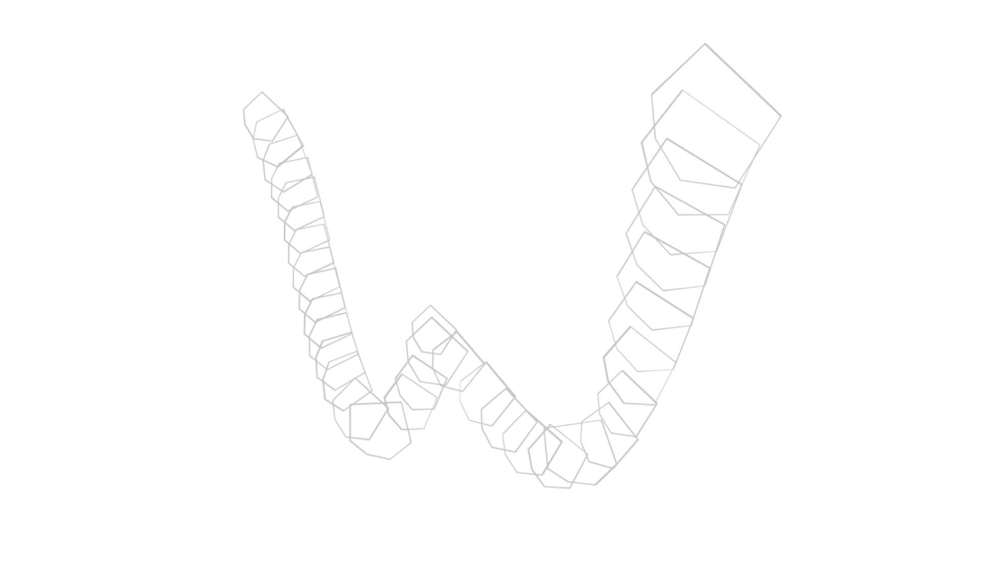

### 
**↓**

### 
ConvexHullChainProducer

### 
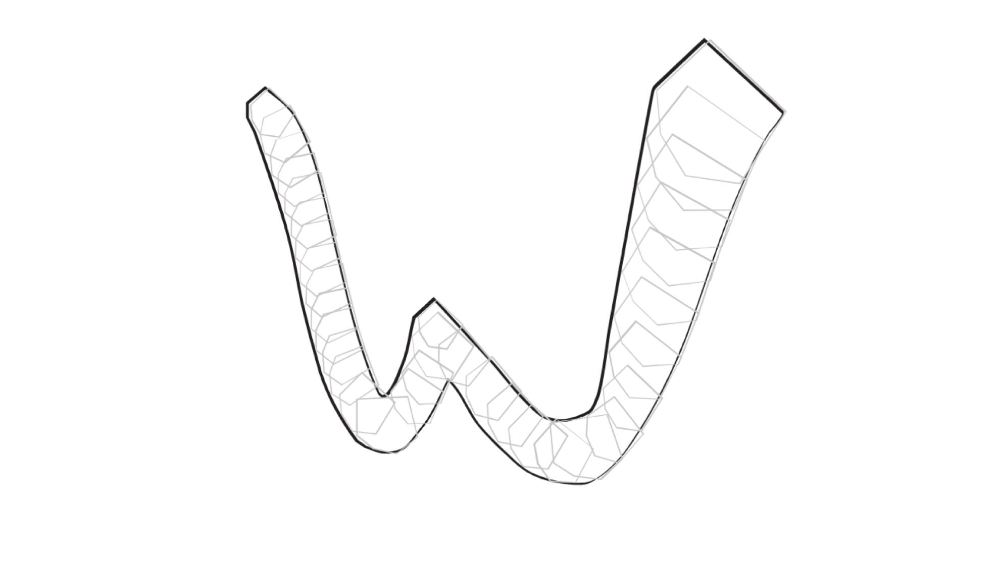

### 
**↓**

### 
PolygonMerger

### 
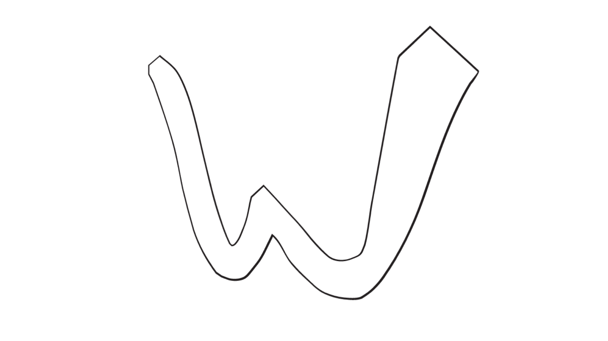

### 
**↓** **↑**

### 
PolygonSimplifier

